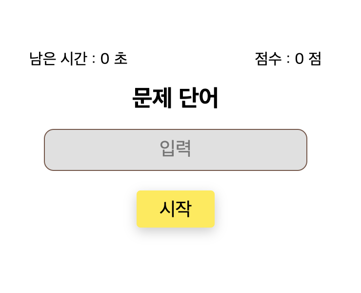
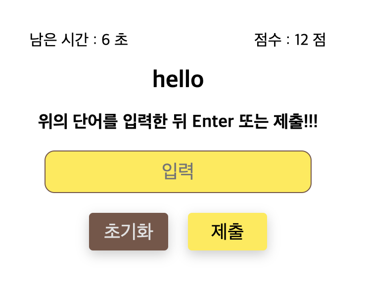
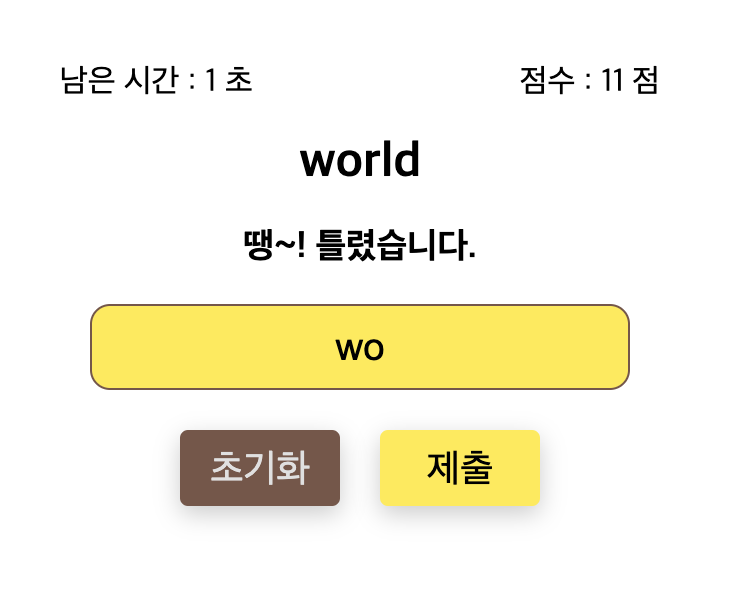

# Typing Game (타자게임)


 
 

## 과제

주어진 단어가 표시되면 input에 단어를 정해진 시간 내에 입력하여 점수를 획득하는 어플리케이션 개발

## 데모

https://divlook.github.io/hello-kakaopay

## 설치 및 실행

프로젝트를 추가할 폴더로 이동해주세요.

```
cd <workspace>
```

`git clone` 명령어를 사용해서 파일을 받아주세요.

```
git clone git@github.com:divlook/hello-kakaopay.git
```

프로젝트 폴더로 이동 후 `npm install` 명령어를 사용하여 패키지를 설치해주세요.

```
cd hello-kakaopay
npm install
```

`npm run start` 명령어를 사용하여 webpack-dev-server를 실행할 수 있습니다.

- http://localhost:3000

```
npm run start
```

기본적으로 3000 port를 사용하는데, 만약 변경이 필요한 경우 [.env](./.env)파일의 PORT 값을 변경하거나 아래 명령어를 사용해서 변경할 수 있습니다.

```
PORT=8080 npm run start
```

## 프로젝트 구성 소개

프로젝트의 구성을 간략하게 정리하였습니다.

이 내용을 건너 뛸 분들은 [해결 전략 바로가기](#해결-전략)를 눌러주세요.

### 언어

- TypeScript
- Sass

### 폴더 구조

```
root/
┣ .github/
┃ ┗ workflows/ ----- GitHub Workflows 폴더
┣ @types/ ---------- Declaration 폴더
┣ configs/ --------- 설정 폴더
┣ dist/ ------------ Build 폴더
┣ docs/ ------------ 문서 폴더
┣ src/ ------------- 소스 폴더
┃ ┣ api/ ----------- API 라이브러리 폴더
┃ ┣ components/ ---- 화면 구성요소 폴더
┃ ┣ libs/ ---------- 공용 라이브러리 폴더
┃ ┣ styles/ -------- 스타일 폴더
┃ ┣ views/ --------- HTML 템플릿 폴더
┣ tests/ ----------- 테스트 폴더
```

### 개발 환경

##### 타겟 브라우져

| 브라우져 | 최소 버전 |
| - | -:|
| Chrome | 83 |
| Chrome Android | 86 |
| Safari | 13.1 |
| iOS Safar | 9.3 |
| Explorer | 11 |
| Microsoft Edge | 18 |
| Firefox | 81 |
| Samsung Internet | 12.0 |

##### 빌드 도구

- webpack
- babel
- dotenv
- sass
- postcss
- autoprefixer

##### 코드 Lint 및 스타일 도구

- eslint
- prettier

##### 유닛 테스트 도구

- jest

##### 배포 도구

- Github Action

### 라이브러리

공통으로 사용되는 코드를 분리하여 [src/libs](./src/libs)폴더에 보관하였습니다.

##### Utils

공통으로 사용되는 유틸성 라이브러리입니다.

- [src/libs/utils.ts](./src/libs/utils.ts)

##### Uid

고유한 id를 만들기 위한 라이브러리입니다.

- [src/libs/uid.ts](./src/libs/uid.ts)

##### Message

반복되는 메시지를 재사용하기 위해 메시지를 모아놓은 라이브러리입니다.

- [src/libs/msg.ts](./src/libs/msg.ts)

##### Gamedata

게임 데이터를 불러오고 저장하기 위한 라이브러리입니다.

- [src/libs/gamedata.ts](./src/libs/gamedata.ts)

##### Component

[HTML DOM Element](https://developer.mozilla.org/ko/docs/Web/API/Element)를 `component`단위로 관리하기 위한 라이브러리입니다.

- [Component class 소개](./docs/COMPONENT.md)
- [src/libs/component.ts](./src/libs/component.ts)

### API 라이브러리

API를 공용으로 사용할 수 있도록 라이브러리로 분리하였습니다.

- [src/api/words.ts](./src/api/words.ts)

## 해결 전략

Routing을 통한 Single page application(이하 SPA)으로 개발하기 위해 HTML Element를 전부 자바스크립트로 그려야겠다고 생각하였고, Element 구성요소를 재사용하고 효율적으로 제어하기 위해 컴포넌트 단위로 개발할 수 있는 방법이 필요하다고 생각했습니다. (고생의 시작...)


### Component 추상화 class

컴포넌트를 규격화하기 위해 추상화 Class를 만들었습니다. 컴포넌트 Class에 대한 설명은 [Component class 소개](./docs/COMPONENT.md)를 참고해주세요. (스크롤 압박 주의)

### index 페이지 구현

index 페이지는 [src/views/index.ejs](./src/views/index.ejs)를 템플릿으로 사용하여 생성되며, Vue 또는 React 같은 라이브러리처럼 컴포넌트를 HTML 문서 body 안에 추가할 수 있게 구현하였습니다.

> 아래 코드는 [src/views/index.ejs](./src/views/index.ejs)에서 발췌하였습니다.

```html
<div id="app"></div>
```

> 아래 코드는 [src/index.ts](./src/index.ts)에서 발췌하였습니다.

```ts
import { App } from '~/components/App'

const app = new App()

app.mount(document.getElementById('app'))
```

`app.mount(Element)`를 통해 `App`컴포넌트가 렌더링되고 `<div id="app"></div>` 안에 자식 요소로 추가됩니다. 그 후 해당 컴포넌트와 연결된 자식 컴포넌트 들의 `onMounted` 메서드로 등록된 콜백이 실행되게 구현하였습니다.

### 라우터 구현

라우터는 [src/components/Router.ts](./src/components/Router.ts) 컴포넌트를 사용하여 구현하였습니다.

`Router` 컴포넌트는 렌더링하기 위해 `props.routes` 프로퍼티가 반드시 필요합니다.

> 아래 코드는 [src/components/Router.ts](./src/components/Router.ts)에서 발췌하였습니다.

```ts
interface Route {
    path: string
    component: Component
}

export interface Props {
    routes: Route[]
    fallback?: string
}

interface Context {
    router: Router
    push: (path: string) => void
    back: () => void
}
```

> 아래 코드는 [src/components/App.ts](./src/components/App.ts)에서 발췌하였습니다.

```ts
import { Component } from '~/libs/component'
import { Router } from '~/components/Router'
import { Main } from '~/components/pages/Main'
import { Complete } from '~/components/pages/Complete'

export class App extends Component {
    childs = {
        router: new Router(),
    }

    render() {
        const { router } = this.childs

        router.setProps({
            routes: [
                {
                    path: '/',
                    component: new Main(),
                },
                {
                    path: '/complete',
                    component: new Complete(),
                },
            ],
            fallback: '/',
        })

        return `
            <div id="${this.uid}">
                ${router.render()}
            </div>
        `
    }
}
```

```ts
export class Main extends Component {
    childs = {
        button: new Button(),
    }
    render(ctx: Context) {
        const scope = this
        const { button } = this.childs

        button.setProps({
            text: '이동',
            onClick: () => {
                ctx.push('/complete')
            },
        })

        return ...
    }
}
```

위 코드와 같이 `Router` 컴포넌트를 `App` 컴포넌트의 `childs`에 등록하면 `routes`에 등록된 컴포넌트는 `render(ctx: Context)` 프로퍼티의 첫번째 인자로 라우터의 Context를 전달 받아 페이지 이동을 할 수 있게 구현하였습니다.

##### History

`Router` 컴포넌트는 mount될 때 `History API`를 사용하여 현재 라우트 정보를 `history.state`와 내부 property에 추가합니다.

`ctx.push`, `ctx.back` 메서드를 사용하거나 `popstate` 이벤트(뒤로 가기 또는 앞으로 가기)가 발생하였을 때 `Router` 컴포넌트는 이동할 `route` 정보를 찾고 페이지를 전환합니다.

그리고 페이지가 전활될 때, 현재 `mount`된 컴포넌트는 `unmount`되고 새로운 `route`의 컴포넌트가 `mount`됩니다.

### UI 컴포넌트

##### Button

`<button>` Element의 type, disabled, hidden 속성을 변경할 수 있고 onClick 이벤트를 등록할 수 있습니다.

- [src/components/ui/Button.ts](./src/components/ui/Button.ts)

##### Input

`<input>` Element의 type, placeholder, disabled 속성을 변경할 수 있고 onInput, onEnter 이벤트를 등록할 수 있습니다.

- [src/components/ui/Input.ts](./src/components/ui/Input.ts)

##### Text

텍스트를 입력하기 위한 컴포넌트입니다.

컴포넌트가 생성될 때 `props.tag`에 따라 tagName이 정해집니다.

- [src/components/ui/Text.ts](./src/components/ui/Text.ts)

### 화면구성

##### 게임 화면

게임을 시작하고 단어를 입력할 수 있는 페이지입니다.

로컬스토리지에 게임데이터가 없을 때만 접근할 수 있습니다.

- https://divlook.github.io/hello-kakaopay
- [src/components/pages/Main.ts](./src/components/pages/Main.ts)


##### 완료 화면

게임 결과를 확인할 수 있는 페이지입니다.

게임을 플레이하여 로컬스토리지에 게임데이터가 저장되어 있을 때만 접근할 수 있습니다.

- https://divlook.github.io/hello-kakaopay/complete
- [src/components/pages/Complete.ts](./src/components/pages/Complete.ts)


### 유닛 테스트

유닛 테스트는 `jest`를 사용하였습니다.

`npm run test` 명령어를 사용하여 작성된 테스트 코드를 실행할 수 있습니다.

```
npm run test
```

Pull request 발생시 자동으로 테스트되도록 Github Workflow에 추가하였습니다.

- [.github/workflows/run-tests.yml](./.github/workflows/run-tests.yml)

테스트 코드 작성은 이번이 처음이라 개발을 완료한 뒤에 작성하였는데, 기능 단위로 하나하나 테스트 해보니 동작에 영향을 주지 않지만 의도한대로 동작하지 않던 버그를 찾을 수 있었고 잠재된 문제를 발견할 수 있었습니다.

이번 기회로 코드를 좀 더 안정적으로 작성하는 방법을 배운 것 같아 도움이 되었고 앞으로 실무에서도 사용할 수 있도록 노력하겠습니다. 👍

### 배포 방법

- local에서 개발
- develop 브런치로 push
- pull requests 생성
- PR 발생시 github에서 자동으로 테스트
- 테스트 통과시 PR 승인하여 main 브런치로 병합
- main 브런치 병합시 github에서 자동으로 빌드
- 빌드 완료시 자동으로 github pages로 배포

## 끝

감사합니다
